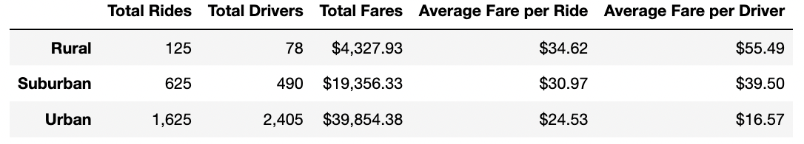
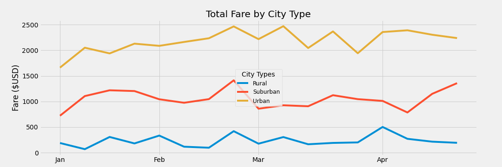

# PyBer Analysis

## Project Overview
**Purpose**: To create a summary DataFrame of ride-sharing data by city type and to create a multiple-line graph that shows the total weekly fares for each city type.

## Resources
[PyBer_Challenge Code](PyBer_Challenge.ipynb)

[Summary_of_Data](analysis/summary.png)

[Multi-Line Graph](analysis/FigChallenge.png)

## Results
- The results of our analysis indicates that urban cities make up the vast majority of the money generated from Jan through April.

- Urban areas also have the highest number of drivers and number of total rides. 

- However, urban areas have more total drivers than total rides performed, suggesting that these areas may be oversaturated with drivers.

- Oversaturation of drivers would likely lead to decreased average fare per ride and fare per driver as drivers compete for a limited number of clients. Indeed, urban cities had the lowest dollar return per ride and per driver when compared to suburban and rural cities.

- Suburban and rural areas have fewer drivers performing more rides, which may explain why they have higher average fare per ride and fare per driver when compared to urban cities. 

## Summary
It is interesting to note that urban areas have far greater number of drivers and lower fare per ride and fare per driver when compared to suburban and rural areas. Together, this data suggests that urban areas may be oversaturated with drivers, which is driving down the fare generated per ride and per driver. Conversely, suburban and rural areas appear to be undersaturated with drivers as there are more rides than total drivers and the fare per ride and fare per driver are higher in these areas. Based on this data I would recommend that drivers in urban areas be shifted to suburban and rural areas. This would likely increase the fare per ride and per driver in urban cities without missing out on rides. A good starting place may be to try and acheive a 1:1 ratio of driver to rides in each location. A 4 month trial period could be tested and the results could be compared to this data set, at which point further adjustments could be made to maximize profitabiity.
